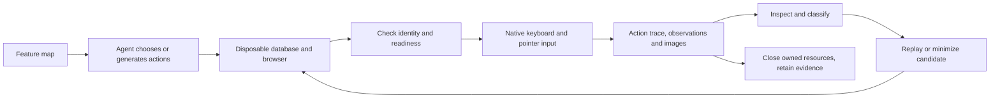

# Agent playtesting

This is the first runnable step toward [issue #2](https://github.com/tensorfish/openms/issues/2): agents can run a bounded play session, inspect evidence, design another experiment and replay a suspected bug. The initial scope is a beginner in Henesys, native sign-in and Quit, movement/jumping, character windows, map chat and reconnect. JEV is not required or installed.



## Run

Complete the normal [local setup](index.md), including dependencies, settings, assets and PostgreSQL. The configured local PostgreSQL role must have CREATE DATABASE permission. Reuse the existing extraction cache. The runner does not download game assets, install browser/model packages or use the original Windows executables.

```sh
bun run playtest --seed 42 --steps 8 --output artifacts/playtest/discovery-001
```

Outside the existing macOS Chrome default, pass `--chrome` with the installed Chromium executable. For example, on Windows:

```powershell
bun run playtest --chrome "C:\Program Files\Google\Chrome\Application\chrome.exe" --plan .agents/skills/verify-openms/plans/smoke.json --output artifacts/playtest/smoke-001
```

All three skills live in the repository under `.agents/skills/`, with no personal skill installation required:

- [verify-openms](../.agents/skills/verify-openms/SKILL.md) contains the feature map, input contract and triage procedure. Invoke it to explore the mapped player flows.
- [create-verification-skill](../.agents/skills/create-verification-skill/SKILL.md) supplies the generation workflow and bundled feature-map examples.
- [maintain-verification-skill](../.agents/skills/maintain-verification-skill/SKILL.md) audits the verification skill and keeps its feature map current.

The creator, maintainer and their bundled references are unchanged copies from [pstack revision `157aae39a733135e93d8b5b19ff62c6a84b0ad56`](https://github.com/backnotprop/pstack/tree/157aae39a733135e93d8b5b19ff62c6a84b0ad56/skills). Each imported skill directory includes the upstream MIT license.

The runner creates a unique test database and an ordinary player account, uses ports 3297/3197, and closes its resources after success or failure. Override ports with `--server-port` and `--client-port`, and the local PostgreSQL connection with `--database-url`. Existing listeners are not reused. Use one run per checkout at a time because frontend builds share generated output paths. Your usual game session and database are not test fixtures.

### Focused cases

Pass any of these committed plans to `--plan`, with a fresh output directory for each run. They run without a model or API key.

| Plan under `.agents/skills/verify-openms/plans/` | Checks |
| --- | --- |
| `smoke.json` | Movement, jumping, four windows through keyboard/HUD and native close buttons, then reconnect. |
| `window-dismissal.json` | All four windows toggle closed with their shortcuts and dismiss with Escape after HUD entry. |
| `chat-focus.json` | Shortcut letters and a held arrow remain in the editor; Escape discards a draft; Enter produces one server-confirmed map-chat row; game controls work after leaving the editor. |
| `session-cycle.json` | GameMenu → Quit → OK revokes the session; normal sign-in recovers the character/map/mesos with a new connection; subsequent window/chat controls work. |

The extended action format adds `chat` with `text` and `mode: send` or `cancel`, and `relogin` with no extra fields. Chat accepts 1–70 printable ASCII characters, without surrounding spaces or slash commands. Window actions accept optional `close: button`, `shortcut` or `escape`; omitted `close` keeps the original close-button behavior. Existing seeded sequences stay unchanged; use explicit plans for chat and relogin.

## Evidence and replay

Each new output directory retains a validated `plan.json`, a structured `report.json`, and screenshots when a browser was reached. Reports record source/catalog/rules identities, native actions, before/during/after observations, bounded browser/service events and cleanup status. Existing directories are rejected to preserve prior runs. Raw results stay ignored or outside the checkout.

```powershell
bun run playtest --chrome "C:\Program Files\Google\Chrome\Application\chrome.exe" --plan artifacts/playtest/discovery-001/plan.json --output artifacts/playtest/replay-001
```

| Result | Exit | Meaning |
| --- | --- | --- |
| `pass` | 0 | The executed input sequence satisfied its narrow checks. |
| `candidate` | 1 | A player-flow or runner failure needs evidence review and replay. |
| `blocked` | 2 | Setup, cancellation, unavailable services, changed identity or cleanup prevented a trustworthy completion. |

A seeded sequence is reproducible input, not deterministic simulation timing. A repeated failure with the same symptom is stronger evidence than matching hashes alone. An agent should minimize its plan and record expected versus observed behavior before proposing a product fix. Creating a GitHub issue or comment remains an explicit user action; the runner publishes nothing.

`bun server/tools/playtest-doctor.js --url http://127.0.0.1:3197` reads the catalog/configuration of a running fixture and calculates the expected browser identity. It explicitly does not prove browser source, authentication or process ownership. The live runner additionally checks its authenticated browser observations and owns the listeners it started. After a surprising failure it repeats the service check, captures evidence and tears down before retrying.

## Initial verification and finding

On 2026-09-18, the 11-action skill plan passed on Windows with Bun 1.4.2, installed Chrome and local PostgreSQL. Sign-in, walking/jumping, all four windows through keyboard and HUD, and one reconnect completed. Both failed and successful runs retained their evidence after cleanup. An independent database/listener check found no remaining test resources; the normal game listeners remained available.

Seed 42 with eight actions found an intermittent reconnect failure. Replaying its saved plan in a fresh fixture produced the same symptom at a different reconnect: the initial run failed at action 8, the replay at action 5. The server emitted `socket.closing` with `SERVER_BUSY` and WebSocket close code 1008. The browser returned to sign-in with `status: disconnected` and no connection epoch, then exceeded the 30-second readiness wait. The service doctor still passed. Expected behavior is a new active connection retaining the character, map and mesos.

Reproduce with the discovery command above and replay its saved plan in a new output directory. A two-action plan containing only two reconnects passed, as did the skill baseline. The failure is timing-dependent; the shortest failing plan and root cause remain unresolved. Treat this as a replayed bug candidate, not a deterministic regression test or a proven server diagnosis. This change includes no speculative game fix.

The replay and passing skill baseline used application base `db19e4e6b01b17b40595d0539ecf6c1b81729ea9` with the new playtest tooling, and these observed identities:

| Identity | SHA-256 |
| --- | --- |
| Browser source build | `b26e3414f3adfcda12411bd8ccafadeffc0f96b858ca295f499ae01e7fe1063a` |
| Catalog | `10f5773024c066af7e5040aa1b5dacae4f0975178cc7c309fcc107e114c9083d` |
| Rules | `b56ddae74f094fd7cc67df130b75179e08a3235069628daafa0e2d79324bb9b8` |
| Assets | `9eac715afce36f7efc1aa07b4003f1b02df995823fb7fd03be2451688fe3ff41` |

These identify the recorded experiments, before the final failure-classification and cleanup-reporting adjustments. Tool edits can change the source build identity without changing game behavior. Raw reports, logs and images remain local ignored artifacts.

## Scope and next steps

The action vocabulary covers walking, jumping, opening/closing Item/Equip/Stat/Skill windows, map-chat submission/cancellation, native Quit/sign-in, and the visible development Reconnect session button. Agents can generate seeds or supply their own bounded action plans. They use read-only snapshots to inspect outcomes; gameplay input stays on the normal keyboard/pointer path. No agent-control permission checks are removed. Chat checks observe the sender's server acknowledgement, not delivery to another player. Session checks establish character/map/mesos continuity, not every inventory or progression field.

Extend the existing `client/tools/scenarios/` and isolated fixture for NPC quests, portals, combat, inventory transactions and a second-player witness. Add an action and its observable contract together, with a replayable fixture. Later, a model such as JEV could choose actions through the same interface; observation, evidence, refusal handling and cleanup remain necessary regardless of the planner.

The fixture and browser work on the local machine. This version does not add unattended schedules, GitHub-hosted asset downloads or a claim of whole-game coverage. Follow [change-scoped validation](validation-method.md#validation-scope) when extending it.
