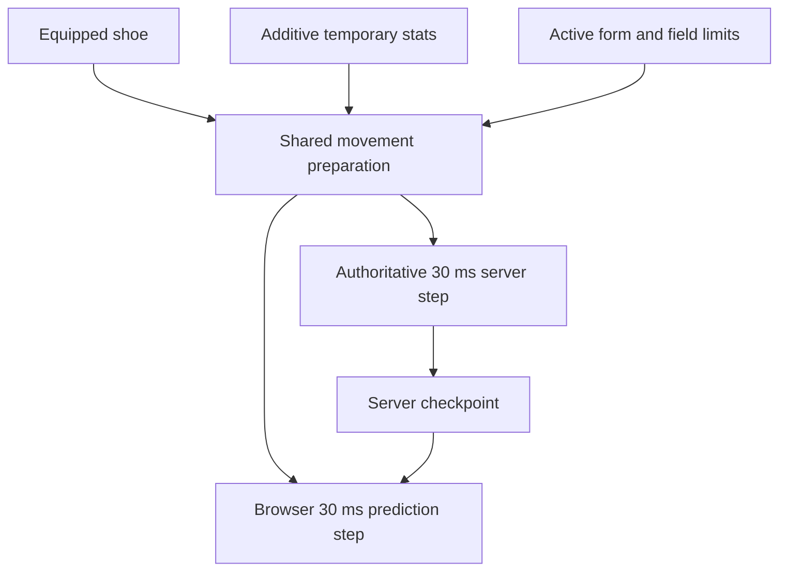

# Online movement parity

The online client and server use the same original-data movement preparation and **30 ms** simulation step. This repair changes server coefficients without changing the fixed-step clock or adding interpolation to the physics kernel.

## Cause and correction

The server previously passed `projectCharacterStats()` display totals into `updateSkillMovement()`. That function expects additive temporary bonuses. A normal displayed **100%** became **100 base + 100 bonus**, hitting the speed/jump caps of **140% / 123%**.

| Input or coefficient     | Correct meaning                                          | Owner                         |
| ------------------------ | -------------------------------------------------------- | ----------------------------- |
| Display speed/jump `100` | Total percentage shown by Stat                           | `projectCharacterStats`       |
| Derived speed/jump `0`   | No temporary bonus                                       | `SkillSystem.derived()`       |
| `walkSpeed` at 100%      | 125 world pixels/s                                       | Original Physics.img globals  |
| `jumpSpeed` at 100%      | 555 world pixels/s before gravity                        | Original Physics.img globals  |
| First grounded jump tick | `y = −16.75`, `vy = −495` on the flat regression fixture | Recovered 30 ms integration   |
| Normal upper caps        | Speed 140%, jump 123%                                    | Original normal-player branch |

`updatePlayerMovement(sim, equipment, items, derived)` is the shared movement kernel used by the authoritative server and browser prediction. It first resolves the real shoe's friction/swimming properties, then applies cached temporary skill bonuses and active form rules from original base coefficients. Recasts/cancellation cannot compound an earlier multiplier. The server keeps display/combat totals for their existing consumers.



The browser predicts movement immediately, then restores server checkpoints and replays retained inputs. The server owns consequential positions, including ordinary movement. The shared helper preserves equipment and buff semantics without expanding the set of supported movement controllers.

## Client-owned motion

The client owns immediate presentation. The server owns legal movement. The former client-position-adoption policy was replaced by the [optimistic-client implementation](optimistic-client.md) to preserve the authority boundary while retaining responsive controls.

| Contract | Owner | Behavior |
| --- | --- | --- |
| Local input | `OnlinePrediction.predict`, outgoing input journal | Fixed 30 ms prediction proceeds before a packet is sent; up to 128 unsent samples retain original input identities. |
| Motion hints | `inspectReportedMotion`, `World.adoptResumedMotion` | Optional bounded XY/velocity reports are diagnostics. Neither ordinary reports nor reconnect installs client position or velocity. |
| Checkpoints | `OnlinePrediction.adoptCheckpoint` | Every checkpoint restores trusted continuation and replays the retained suffix silently. Normal corrections are smoothed in presentation space. |
| Forced movement | `serverOwnsPosition` | The legacy `authoritative` wire flag marks death, transitions, seats and unpredicted movement skills. It additionally retires incompatible local impulses; `false` does not grant client authority. |
| Impulses | `motion.diverts`, `beginOptimistic` | Local movement skills start immediately. A matching divert retires the preview and replay starts from the checkpoint containing the server impulse. Rejection rebases on the latest trusted checkpoint; a departed-field token cannot restore old motion. |
| Watchdog | [watchdog.js](../server/src/watchdog.js) | Optional discrepancy evidence/kicks supplement independent movement simulation. Inside-tolerance reports still cannot move the server actor. |
| Reconnect | Connection epoch plus server checkpoint | Retires the previous input journal and restores current server state; no time or distance is granted for a claimed disconnected trajectory. |

The watchdog remains off by default. `OPENMS_MOTION_WATCHDOG_ENABLED=true` in `.env.server` enables its lag-tolerant evidence policy after restart. This changes diagnostics and kicking, never server authority or reconciliation.

Prediction is bounded by 128 history entries and a five-second stale observation threshold, and stops on disconnect. These are recovery limits, not an offline-play guarantee. A longer upstream stall may lose movement outside the server input window; historical trajectory reconstruction is not implemented. Unpredicted teleport/rush/dash/wings still follow server checkpoints. The shared kernel retains original geometry, movement coefficients and contact rules.

Focused continuation checks:

```sh
bun test client/test/divert-alignment.test.js server/test/hit-divert-replay.test.js server/test/motion-adoption.test.js
```

## Latency and input timing

The most recently received server tick is already one network leg old. [Input timing](../client/src/online/input-timing.js) estimates when a sample will reach the server and advances through delayed observations while its 128-sample history and stale-observation limits permit. The server independently admits samples within eight ticks of its **current** field tick. Applying that same eight-tick cap to an old received tick would make ordinary 500 ms RTT traffic arrive too late.

Late or prematurely scheduled samples are acknowledged and retired without disconnecting the session. Brief delivery bursts and outlying heartbeat measurements have separate bounded handling. Active movement observations and impulses continue during same-field artwork refreshes; a long initial load obtains a fresh baseline before enabling input. These are transport policies; the recovered 30 ms physics step and movement coefficients remain unchanged. [Protocol limits](server/protocol.md#slow-connections-and-presentation-recovery) define the bounds, and the [500 ms RTT check](validation.md#slow-network-gameplay-repair) records the exercised workload.

## Optimistic presentation policy

The client follows the standard authoritative-loop model rather than giving either side free
run: the owning client predicts on the fixed 30 ms timestep, buffers its inputs with sequence
numbers, and the server acknowledges the last input it processed so unacknowledged inputs can
be replayed; remote entities are drawn from buffered samples slightly in the past; and every
durable outcome stays server-owned. The useful rules for this repair were:

- **Predict only what the client owns, and only as presentation.** Predictions never grant
  damage, HP, loot, rewards or cooldown resets; a hacked client can draw any number it likes
  and changes nothing.
- **Make the prediction a replay of the authority's own rules**, so divergence is small and
  the correction is invisible. Contact damage uses the authority's receiver rectangles and hit
  window; mob recoil uses the recovered coefficients; a projectile uses the published flight
  plan; a drop replays the published source/landing plan.
- **Correct small errors by bending, never by hiding them.** The local player absorbs sub-pixel
  error and glides larger error at walk speed; a projectile bends onto the authoritative plan.
  Suppressing a legitimate correction is how a player ends up walking through walls.
- **Bound everything a client can claim.** The watchdog envelope, the eight-tick input
  admission window and the server-measured attack rewind all cap what a report can buy, and
  the rewind is derived from the connection's own measured round trip rather than a claim.
- **Favour the actor with bounded rewind.** A shot is judged against the target's swept
  current-and-previous body and the view window the attacker was rendering, capped at 16 ticks,
  so latency costs accuracy nothing without becoming a range cheat.

References: [Gambetta's client-side prediction series](https://www.gabrielgambetta.com/client-server-game-architecture.html),
[Colyseus netcode](https://docs.colyseus.io/netcode), and Roblox's
[server-authority write-up](https://d3fel7ao8ljmgc.cloudfront.net/fr/newsroom/2026/07/creating-responsive-cheat-resistant-games-roblox-server-authority).

## Local movement correction continuity

Ordinary checkpoints still restore the trusted kernel and replay its retained input suffix. Corrections preserve the **interpolated pose at receipt time**, including any correction already in progress; comparing the rendered pose with the newest full kernel position double-counted the between-tick offset and caused visible backward steps. Even sub-three-pixel differences ease instead of snapping repeatedly.

The ordinary correction curve accounts for smoothstep's peak derivative and limits its added speed to **0.125 px/ms**. Its duration can exceed 600 ms after a delivery gap; it remains bounded by the 192-pixel ordinary correction limit. Explicit server relocations retain their separate 512-pixel/600 ms policy. These are presentation limits: movement validation, server checkpoints and the eight-tick input admission window are unchanged. Small RTT fluctuations preserve the filtered field clock so replaying delayed packets does not restart movement timing. See the [high-latency walking regression check](validation.md#movement-correction-regression-at-high-latency).

Ground contact takes priority over this easing. [Presentation contact](../client/src/online/prediction-contact.js) projects horizontal corrections onto the current floor or a connected slope, with the existing 32-transition bound. An offset cannot bridge an unconnected ledge or wall; it falls back to the uncorrected path. Landing retires the vertical correction and retains only the original one-quantum landing interpolation. The visible hit-recoil simulation owns this constraint while its preview is active, so an airborne recoil is not pinned to the main kernel's floor. No presented coordinates are written back into physics. See the [ground-contact regression check](validation.md#ground-contact-during-correction).

## Local combat presentation

[LocalCombat](../client/src/online/local-combat.js) starts the character's attack pose and weapon sound on the outgoing input edge. Skill commands start their authored pose, Use cue and available projectile preview before the reply. The pose uses original avatar frame durations, weapon speed and observed speed buffs. Local action locks expire on that same clock; a delayed confirmation cannot lock movement again or replay a completed pose. Death, seats and server-owned movement transitions retain their authority.

Each preview retains its input sequence or skill operation ID. Combat state, motion locks and weapon/projectile events echo that identity; the browser suppresses only its own matching presentation. Refusal cancels that request's remaining visuals, and field replacement releases timers, animations and leases. Records are bounded to 32 actions and 60 seconds; confirmed records become eligible for removal after five seconds. Damage, HP/MP, ammunition, target selection, knockback, loot and cooldown admission remain server-owned. A predicted flight can miss the eventual authoritative target; it grants no hit, damage number or reward.

**Incoming feedback.** [LocalIncoming](../client/src/online/local-incoming.js) resolves the other half of the exchange. The defender already draws a mob's authored swing from a published action, so when that action reaches its authored `attackAfter` the browser tests the same area rectangle against the same ordinary receiver (`00af14b8`, prone `00af14c8`) and, on overlap, rolls `PhysicalDamage.receive` from the mob's published attack statistic, shows the digit at once and starts the authored flinch face (`PLAYER_HIT.timerMs`). A `bodyAttack` mob is resolved the same way on the first drawn frame its authored body overlaps the player, so simply walking into a monster no longer waits a round trip for its contact tick; both share the authority's hit window (`rejectsHit` refuses every incoming outcome for 1500 ms), so a prediction cannot tick faster than the server's own cadence. This is a presentation prediction only: HP, death and status effects still follow the authoritative `combat.impact`. The digit, flinch, blink, hit sound and provisional recoil play locally; the impact consumes the prediction by actor and reconciles it once (see [local impact feedback](#local-impact-feedback)). A missed or refused authoritative outcome is still shown, so a wrong guess is visible as a correction rather than silently kept. The original client is decisive for outgoing feedback and server-driven for incoming; extending the same local-resolution principle to incoming presentation is an OpenMS latency policy for a 500 ms link, not a recovered Nexon rule, and it is recorded as such here.

**Mob recoil.** The original attacker resolves the mob's reaction and its knockback locally: `0066b6fc` dispatches the reaction from the same call chain as the key press, and `009bbdfd`/`009bc2bb` integrate the recoil as a scalar foothold distance (ordinary 130 px/s braking at 400 px/s², strong 300/200) before `009b1646` maps it back onto the segment tangent. [local-hits.js](../client/src/online/local-hits.js) now starts the same authored profile on the release frame, so the authored `hit1` pose, the damage digit and the recoil all begin together instead of the knockback arriving one round trip later. It is still presentation: the offset drawn is `predicted − authoritative displacement`, so the server's own identical trajectory is never added twice, and a hit the authority never confirms is released over the same braking rate after the reaction window. Flying mobs keep their separate flight controller and are not predicted here.

**Remote skill visibility.** Every admitted cast is visible to the whole field; there is no self-only category. The authority broadcasts the caster's authored phase through [AuthoritySkillResources.playSequence](../server/src/skill-resources.js) (`skill.visual`), a projectile through `onSkillProjectile` (`projectile` + the `ball` visual), each hit through `combat.impact`, and party effects at each recipient through [publishPartyVisuals](../server/src/party-skill-visuals.js). Basic attacks and mob attacks additionally emit `combat.attack`; skill casts do not, so a skill's pose reaches peers through `combatState` and its artwork through `skill.visual`. The client suppresses only its own echo (`local-skill-feedback.js`, `local-projectiles.js`), so a peer can never be hidden by it. Two real gaps were repaired: an event-created visual could be released by an older acknowledged snapshot that predated it (now held for one reconciliation, [native-skill-presentation.js](../client/src/online/native-skill-presentation.js)), and `OnlineUI.cast` dereferenced its local combat owner unconditionally, so a client without one threw before sending the cast.

**Projectile flight.** A skill's ball reached observers only as acknowledged `position` samples chased over a fixed 90 ms window on a different timeline than the thrower's drawn avatar, so it trailed or led the shooter and stepped between snapshots. The authority's flight slot now publishes its authored plan (`flight: {startX,startY,endX,endY,durationMs,delayMs}` on `skillVisual`), and [native-skill-presentation.js](../client/src/online/native-skill-presentation.js) integrates that straight line locally from the plan on receipt, exactly as the thrower's [LocalProjectiles](../client/src/online/local-projectiles.js) preview and the authority's `startFlight`/`stepFlight` both do. The thrower additionally adopts the authoritative plan when its echo arrives and bends onto it at a bounded rate, so both screens show the same trajectory without restarting the ball or snapping it.

Late movement remains expired. A separate server queue retains at most eight attack **press edges**, up to two seconds old, for current-state combat admission. A press followed by release in one delayed burst is consumed once with its original sequence. It neither replays old motion nor bypasses attack cadence, resource costs or field ownership. Blur/disconnect neutralization and field changes clear this queue.

### Local impact feedback

Outgoing and incoming previews read `OnlineUI.state.presentation.stats`, the same live server-published stats used by the stat window. The former `owner.hooks.characterStats` access was not connected by the browser entry, so both paths silently skipped all local hits despite unit fixtures supplying that hook.

At an authored release/flight deadline, the local attacker tests the mob's drawn receiver and presents the number, hit pose, original sound and provisional mob recoil. Contact and authored mob areas test the local drawn player immediately. Incoming feedback starts its number, flinch, blink, sound and recoil locally; a field-owned 1500ms protection clock advances once per frame, not once per nearby mob. Dead/spawning mobs and already-protected or dead players cannot start another preview. Audio and digit consumers share one reconciliation decision for each received impact.

[LocalHitMotion](../client/src/online/local-hit-motion.js) owns a separate movement kernel for provisional player recoil. It copies the current local continuation once, applies the original ±270/-270 impulse, follows the same fixed input steps and supplies the drawn position. Unconfirmed recoil does not change outgoing motion reports, HP or inventory. A matching source-tagged server hit adopts the already-presented continuation once; a miss/resisted recoil or four-second expiry eases back to the untouched local movement path. Field changes, death and relocations clear the preview. This is optimistic feedback, not a new client authority over hit admission or damage rolls.

### Remote motion

A peer's motion reaches the browser on two deliberately different paths. Membership, appearance and removal ride the ordered, acknowledged `state` frame, which the server serializes behind an application-level ack so at most one is outstanding; that path is therefore bounded by the **round trip**, and at 500 ms ping a peer's published position refreshed only about twice a second. Sampled motion rides the un-acknowledged `peers` frame instead — the browser form of the native **move packet** (`0xb6`, `CMovePath::SetMovePath` at `0068a33c`), which carries a list of 30 ms samples and is never gated by a receipt. The server publishes one sampled state per changed peer per 30 ms tick (bounded by `MAX_PEER_MOTIONS`, rotating fairly in a crowded field), and the browser applies it straight to the drawn actor. Fixing the cadence is what removes the "floating" and floor penetration: before it, every forecast had to bridge a full round trip.

[RemoteMotion](../client/src/online/remote-motion.js) buffers those samples and draws the actor slightly in the past. It interpolates with a cubic Hermite that matches both the position and the velocity of the two bracketing samples, and it slews its playout delay from the measured sample interval and jitter (**90 ms/s**, bounded **60–320 ms**). A dense per-tick stream converges to the **60 ms** floor. The buffer clock is never restarted by a packet, so consecutive samples join without a seam — the [recovered native move-path replay](native-lag-handling.md#remote-characters-buffered-move-path-replay) in browser form. Interpolation now spans two authentic 30 ms samples, and a landing span is clamped to the landed sample's foothold surface, so the Hermite can no longer dip a couple of pixels through the platform (the native replay applies the same contact). When the buffer is momentarily shallow the newest sample is forecast for at most **120 ms**, then the velocity coasts to rest over a **200 ms** time constant instead of sliding for the whole gap. The drawn pose chases the buffered target along the error vector at **1.2 px/ms**, which is above every original movement speed (`walkSpeed` 125, `jumpSpeed` 555 and `fallSpeed` 670 px/s from `Map.wz:Physics.img`), so a jump, a fall or a dash is never slowed down by the correction. An error over **96 px** — more than the fastest publication of travel — cannot be a reconstruction artifact, so it is presented outright, as is a changed mob generation; an explicit relocation holds its destination until a full movement state arrives, and old velocity and foothold contact cannot pull the actor back. These are browser presentation policies, not recovered AI rules.

[RemotePlayerPath](../client/src/online/remote-player-path.js) prepares 21 points at 30 ms intervals per received player state, using shared field geometry and the server's compact movement hint. It follows connected footholds, predicts jump gravity and downward landings, respects down-jump exclusions, clamps ladder motion to its endpoints, and coasts with the received swim/fly velocity. Seats and death hold their position. Traversals are bounded by the existing geometry transition limit. Mobs retain the simpler velocity forecast clamped to their current supporting foothold.

**Entry freeze.** A player still loading is server-internal `state: "preparing"`, so its physics is not stepped and its simulation stays frozen in the initial airborne spawn state. The ordered `state` frame still describes it, and arming the free-fall forecast from that frame made the drawn peer drop once per round trip and snap back — a sawtooth whose amplitude grows with latency. The shared-geometry forecast is therefore armed only by the first un-acknowledged move sample ([scene.js](../client/src/online/scene.js) `peers`); until then the held sample has zero velocity and the peer stands frozen at its spawn. When the loading client reports ready the authoritative simulation steps once and peers see a single authentic fall, exactly as the native move-path replay only advances on received samples.

**Attack target timing.** Drawing remote actors in the past means the player also aims at their past position. Two mechanisms keep combat fair without giving the client damage authority. Outgoing selection tests the mob's receiver as the **union of its current and previous position** — the original `00678476` selects through `00664559(...,1)`, which unions the same facing rectangle at `+0x510/+0x514` and `+0x518/+0x51c` — so one tick of target motion cannot carry a body out of a swing. On top of that, the authority widens the same sweep across the view window the attacker was rendering (`attackRewindTicks` in [field-combat.js](../server/src/field-combat.js)), derived from the acting connection's **measured round trip** half plus a bounded playout allowance, capped at **16 ticks**. The window is server-measured, never client-claimed, and bounded, so it cannot become a range cheat. With compensation in place the playout delay costs combat accuracy nothing, so the presentation can keep favouring smoothness over latency. Damage, HP, death, loot and rewards remain server-owned.

Remote animation clocks advance between publications, and a dropped frame may advance them by at most **two 30 ms quanta** so a hitch cannot jump an animation through the gap. Delayed copies of the same attack retain the furthest presented phase; a new action/start tick resets it. The field-owned visual clock stops during pause/inactive presentation, including confirmed pickup arcs. No predicted position or action is written back into server entity state. Drops use their separate [known flight and hover plan](drop-motion.md#online-presentation-through-delayed-updates), which can continue beyond the remote actor's buffer horizon.

The [remote motion check](validation-method.md#remote-player-and-drop-check) exercises two native browser clients under delayed delivery. This forecast cannot know another player's future keys, and does not implement every wall collision, movement skill or special controller. The [combat latency check](validation-method.md#combat-latency-check) covers local combat and the simpler mob forecast. Neither establishes original Windows runtime parity.

## Portals and transitions

The local player is presented from its own prediction, never from the remote interpolator — including while the transport is `transitioning` or `synchronizing`. Drawing the self from received publications would place it at a delayed server snapshot and throw its coordinates before the map changes. While a transition is pending the prediction is simply not stepped, so the character holds its portal position; its coordinates change at the destination install.

A **same-map** portal or teleport is the authority's own relocation, delivered as an observed `world.teleport` event. The client adopts it into the prediction kernel with the same `relocateSimulation` the authority applies, so the next predicted step extends the arrival instead of pulling the player back to the pre-portal position. Cross-map travel replaces the predictor outright from the destination snapshot.

## Skill snapshot continuity

The September 14 follow-up traced three independent failures in the real online path:

- Every paid skill publishes a profile snapshot. `main.install` previously recreated the local physics state even when the character, connection and field had not changed, losing the current impulse, contact state, interpolation anchor and input history. Same-field refreshes now preserve all of these while retaining lifecycle ownership until presentation work completes.
- `OnlineUI.optimisticImpulse` was passed the `OnlineScene` wrapper, whose physics lives on its nested `scene`. Facing resolved to zero, so the apparent optimistic path never started. It now reads the actual local simulation. Rank-20 Flash Jump begins with the recovered `±550/-350` px/s request before its receipt; its server echo is consumed once.
- A pending skill or inventory transaction incorrectly asserted position ownership. Only an actual field transition does so. Ordinary action locks and ladder movement retain client XY. The watchdog still records deviations and disconnects impossible or repeated suspicious movement.

The local cast gate avoids grounded, locked and insufficient-MP impulse attempts. A per-airborne-use latch and the original grounded impulse recovery prevent repeated keys from restarting the jump; a response from a departed field cannot restore an obsolete checkpoint.

Consecutive Flash Jump effects retain the same prepared animation resource, but each restart now publishes a distinct `playbackId`. The browser resets the new playback to its own origin instead of interpolating from the previous cast. The original `Effect.wz:BasicEff.img/Flying/` sequence lasts 600 ms; rapid landing/jump repetitions can restart it before expiration. A native keyboard reproduction measured a 221 px offset before this repair. WZ frame offsets and facing remain unchanged. [Original movement-effect dispatch](ghidra-physics-motion/time-loop/0097fdf8.c.txt) selects `Flying`/`Flying1` and the character's position for each trigger. The shared skill controller also records the physics `groundJumpSequence` when consuming Flash Jump, allowing a new ground jump even if a profile transaction suspended the skill clock across the landing.

The focused check below now covers three ordinary airborne casts plus two rapid consecutive casts, inspecting rendered effect origins, replay identity and screenshots. `skill-projectile-chase.test.js` retains interpolation within a playback and verifies that restart cancels an unfinished chase; `skill-visual-replay.test.js` exercises the actual WZ sequence and wire schema.

Flash Jump admission also waits for movement packets already queued ahead of its command to reach their scheduled field tick. Previously an immediate jump/cast could be checked against the preceding grounded state and rejected. The client still applies its impulse at input time; the server never advances physics from a command. The bounded wait captures one target tick, checks field/connection continuity, and rejects stalled or paused clocks before costs are paid.

[Native browser report](validation/skill-motion/report.json) records three successful airborne Flash Jumps in Henesys using real keyboard input, the original packaged WZ artwork, and the production server with disposable account/database state. [Frame samples](validation/skill-motion/frames.json) show zero regressing prediction ticks, zero unready/loading frames and no authoritative position frames during these casts. [Validation results](validation.md#skill-cast-stutter-repair) retain the measurements and earlier failures.

```sh
bun server/tools/check-skill-motion.js --output /tmp/openms-skill-motion
bun test client/test/online-skill-motion.test.js client/test/divert-alignment.test.js server/test/motion-adoption.test.js
```

The original executable was freshly decompiled with `docs/tools/knockbackFocus.java`. [Full output](ghidra-client/knockback-trajectory.txt) retains `007a6353` (player impulse merge), `009bbdfd` (mob recoil), `0066b6fc` (reaction dispatch) and `00950921` (skill dispatch containing the movement branches). Ground recoil at `009bc2bb..392` integrates scalar foothold distance; `009b1646` maps it to world XY using the normalized tangent. A prior partial report misidentified the separate airborne mode-3 branch as ordinary ground recoil; that interpretation and the associated slope test are corrected. Ordinary recoil remains 130 px/s with 400 px/s² braking; strong recoil remains 300/200. Player recoil remains the recovered ±270/-270 impulse, subject to its existing hit/resistance gates.

Original `Skill.wz` supplies Flash Jump 4111006 rank-20 MP cost 13 and prerequisite 4111005 level 5. The supplied Cosmic reference `src/main/java/net/server/channel/handlers/MovePlayerHandler.java:39` reads the player's reported movement, updates the map position and broadcasts it to other players; it is supporting emulator evidence, not Nexon source. No original C/C++ source is present in the supplied client directory. These results do not establish Windows runtime parity or all special mob controllers.

## Source evidence

| Evidence                            | Location                                                                                                                                            |
| ----------------------------------- | --------------------------------------------------------------------------------------------------------------------------------------------------- |
| Original globals and motion quantum | [Decoded WZ globals](ghidra-physics-motion/wz-globals.json) · [Physics evidence](physics-evidence.md)                                               |
| Normal movement and caps            | Native `0094d8f1..0094d9be`                                                                                                                         |
| Form and shoe coefficients          | Native `0094d3d9`, `005cac3d`, `0094da00`                                                                                                           |
| Field-limit override                | Native `0094d311`                                                                                                                                   |
| Player impulse merge                | Native `007a6353` · [Knockback trajectory](ghidra-client/knockback-trajectory.txt)                                                                  |
| Ground mob recoil                   | Native `0066b6fc` / `009bbdfd` · [Knockback trajectory](ghidra-client/knockback-trajectory.txt)                                                     |
| Shared implementation               | [skill-movement.js](../client/src/physics/skill-movement.js)                                                                                        |
| Client / server call sites          | [prediction.js](../client/src/online/prediction.js) · [world.js](../server/src/world.js) · [motion-authority.js](../server/src/motion-authority.js) |
| Wire continuation                   | [motion.js](../shared/motion.js) · [Protocol checkpoints](server/protocol.md#motion-checkpoints)                                                    |

## Scoped verification

### Jump audio and midair attacks

| Symptom                                  | Cause                                                                                                                                                       | Current behavior                                                                                                                                                                                                                                                                      |
| ---------------------------------------- | ----------------------------------------------------------------------------------------------------------------------------------------------------------- | ------------------------------------------------------------------------------------------------------------------------------------------------------------------------------------------------------------------------------------------------------------------------------------- |
| Jump sound missing                       | The browser predictor did not consume the confirmed `groundJumpSequence`.                                                                                   | `OnlinePrediction` observes new server-confirmed jump sequence numbers and cues original `Game/Jump`. Duplicate checkpoints, replay and initial/rejoin baselines stay silent. Invalid airborne jump presses produce no sound.                                                         |
| Position steps when attacking midair     | An action lock switched the local avatar from prediction to older entity interpolation; the 90ms entity snapshot also overwrote the 30ms checkpoint's lock. | Local presentation continues using the predictor through an action lock. The shared motion kernel suppresses input while continuing gravity/inertia; the latest server checkpoint owns the lock. Local attack pose uses the client action clock; hits and damage remain server-owned. |
| Stationary peer climbing keeps animating | The online peer path reseeked the climb sequence without applying the original consecutive-Y hold branch.                                                   | `ladder`, `rope`, `ladder2` and `rope2` hold their current frame while consecutive authoritative Y positions match, then resume when Y changes. Other actions never inherit the hold.                                                                                                 |

This follows the lock/integration order in `physics/simulation.js` and the retained original `00452792..004527d3` ladder/rope action and consecutive-Y comparisons. No original physics coefficients changed; the remote presentation change is limited to the recovered climb-frame hold. The online read-only snapshot includes audio state and output-capture diagnostics for reproducing sound failures.

The targeted regressions in `client/test/sync-alignment.test.js` cover accepted jumps, duplicate/rejoin suppression, uint32 sequence wrap, motion continuity through a midair action lock, and stationary-versus-moving peer climb frames. `bun server/tools/check-entry-repairs.js` additionally uses native jump/attack input and captures actual audio output with fixture music muted; it reuses assets and owns disposable accounts/database/listeners.

```sh
bun test server/test/movement-parity.test.js client/test/sync-alignment.test.js client/test/physics.test.js
```

The original coefficient repair's retained run passed **33 tests, 795 assertions**. Its regression invokes the real `OnlineWorld.moveActor` path and compares every walking/jumping tick with the shared preparation and integration fixtures. It covers 100%, buff replacement/cancellation, shoe friction/swimming coefficients, anti-slip shoes, riding forms, restricted fields and received checkpoint continuation. Current focused tests cover replay, presentation isolation and motion boundaries; jump/audio regressions extend that coverage.

Geometry and buff inputs are explicit isolating fixtures; original globals are independently decoded. This is executable kernel/server parity proof, not a new Windows capture or a network-latency benchmark. Restart both development commands after this runtime change so rules identities match.
