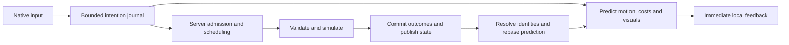

# Optimistic client and delayed actions

**Research and initial implementation, 2026-09-24.** The original inspection below records the working tree based on `db19e4e6b01b17b40595d0539ecf6c1b81729ea9`, including existing uncommitted work. The implemented subset is described next and in the [runtime protocol](server/protocol.md). External references describe their documented versions, not every game's current implementation.

## Implemented subset

- Server-generated damage and critical flags remain authoritative even when a matching client hit report exists. Ordinary and reconnect motion reports cannot install client positions; the shared server kernel supplies every trusted checkpoint. Optional watchdogs add diagnostics, not movement permission.
- Every checkpoint rebases local motion and replays retained input silently. A fixed 128-sample outgoing input journal preserves identities through socket backpressure. Prediction no longer waits for transmission or freezes merely because the last observation is delayed; history capacity and the five-second stale limit still bound it.
- Basic attack edges wait for the current animation, on both sides, within eight-edge/two-second limits. Server commands wait for participant availability and casts for legal action timing, with bounded queues and fresh lifecycle checks. Release/cancel controls bypass unrelated queued work while preserving ordering with their own cast, including release received before server admission completes.
- A 200 ms next-skill buffer for non-channel skills starts the selected action when the local animation finishes. Disposable cost reservations use shared skill cost rules and server-published MP/ammunition modifiers; final costs remain server validated. Reservations survive unknown outcomes and are removed only on rejection or receipt plus a covering profile revision.
- Whole-stack inventory moves can be shown immediately and chained by stable UID. The 32-command/64 KiB client queue sends same-domain writes in receipt order and binds each revision only before its first send. Retry envelopes remain unchanged; refused parents cancel unsent dependents. Previewable actions no longer impose the general native-window pending lock. Splits and economic finalization still await authority.

This first implementation resolves late combat against server state with its existing bounded swept-target tolerance; it adds no historical world rollback. It does **not** add historical movement reconstruction, additional historical PvE hit replay, unlimited disconnected play, wire-level queued acknowledgements, command pipelining, or optimistic trade/reward finalization. Under a long upstream stall, movement may be corrected and expired actions refused. Same-domain command throughput is still receipt-bound even though local presentation continues. Local damage digits remain provisional presentation; authoritative HP and rewards follow server rolls.

The later design sections remain a roadmap where they exceed this subset. [Measured validation](validation.md#optimistic-client-and-queued-actions) records the 122 focused tests and native 500 ms RTT queue/reconnect check. Inspection hashes at the end identify the original findings, not the implemented build.

The initial implementation regressed local movement correction. The [follow-up walking check](validation.md#movement-correction-regression-at-high-latency) reproduces and repairs snapping and clock resets at 0/1,000/2,000 ms RTT with a 1.5-second traffic stall. The original queue check alone was insufficient evidence for local walking smoothness.

Grounded presentation also constrains corrections to connected supporting surfaces. Landing retires vertical correction, preserves only the normal 30 ms interpolation quantum, and cannot carry an old airborne offset into the next jump. Horizontal easing follows slopes and falls back to the trusted path when an offset crosses an unsupported edge. Physics and server admission are unchanged.

## Recommendation

Make local input immediately visible, keep a bounded journal of unconfirmed intentions, and rebuild the predicted view from server state plus the remaining intentions whenever confirmation arrives. The server must independently validate every consequential action before it affects anyone's authoritative state. Corrections can be occasional; validation cannot be occasional.

For OpenMS, combine local movement replay, predicted combat presentation and resource reservations, and a separate queue of discrete actions. Keep the existing authoritative field owner, 30 ms kernel, WebSocket connection and transactional economy. Extend their interfaces rather than introducing a second gameplay authority or a new transport first.

The achievable promise is **immediate controls and continued local play through ordinary latency and short interruptions**. It cannot be unconditional acceptance of everything done offline: another player can take a drop, a target can die, or the server can kill the character during the gap. Those conflicts require correction or rejection. No protocol can distinguish genuinely delayed input from input deliberately withheld by a modified client with certainty.

## What other games establish

These are first-party game/engine explanations, with Fiedler's networking article as an engineering reference. The design consequences are recommendations for OpenMS.

| Example | Documented technique | Application here |
| --- | --- | --- |
| **Factorio**, [Hide the latency](https://www.factorio.com/blog/post/fff-83), 2015 | A disposable latency state applies buffered local actions over the synchronized game state. It supports movement, opening UI, building and other selected interactions. Dependent UI input can continue before the opening action is confirmed. | Predict the small part of the world needed for the next interaction. Its deterministic full-world architecture and trust model are not a template for OpenMS authority. |
| **Factorio**, [The multiplayer megapacket](https://www.factorio.com/blog/post/fff-302), 2019 | Confirmed actions leave the latency queue; the remaining actions reconstruct the visible prediction. Late actions can be scheduled later without stopping everyone. Bugs in replay/order handling generated hundreds of fresh actions during catch-up and overloaded delivery. | Separate replay from new input capture. Preserve action identity/order, bound backlog work and bytes, and never let reconciliation emit fresh commands. |
| **Path of Exile**, [Client-server Action Synchronisation](https://www.pathofexile.com/forum/view-thread/889669), historical manifesto explicitly marked outdated | Describes immediate movement/attack prediction with server-owned combat and rewards. Its worked example sends a tentative server combat result before the animation's contact point, hiding network time inside the animation. | Start the pose, projectile and impact presentation immediately. An early server result can supply exact numbers when it arrives in time; late replies must not restart the swing. This is historical design evidence, not current-mode guidance. |
| **Path of Exile Xbox**, [developer FAQ](https://www.pathofexile.com/forum/view-thread/2036693), 2017 | Describes a hybrid: predict input immediately, but pause simulation when missing server data would make prediction diverge too far. | A finite speculation horizon is a product decision. For OpenMS, tolerate short gaps before entering explicit reconnect/recovery; don't silently promise unlimited offline combat. |
| **Source games**, [Valve's multiplayer networking explanation](https://developer.valvesoftware.com/wiki/Source_Multiplayer_Networking?language=uk) | Local prediction, interpolation of other actors, and server-side historical hit tests solve different problems. Client hit claims are insufficient evidence. Historical hit evaluation can produce fairness paradoxes. | Borrow the authority boundary, not FPS timing constants. Any later PvE hit-history support needs a bounded window and an explicit policy for targets that have since died or changed field. |
| **Unreal Engine**, [networked character movement](https://dev.epicgames.com/documentation/en-us/unreal-engine/understanding-networked-movement-in-the-character-movement-component-for-unreal-engine) | Saves local moves, reproduces movement on the server, checks timestamps, and replays retained moves after a correction. Server time constrains movement duration to prevent speed manipulation. | Reuse OpenMS's shared motion kernel and continuation schema. Validate input-derived motion, rather than accepting a reported destination because it looks plausible. |
| **Unreal Gameplay Abilities**, [prediction keys](https://dev.epicgames.com/documentation/en-us/unreal-engine/API/Plugins/GameplayAbilities/FPredictionKey) | Associates predictions and effects with an identity, handles rejection and echo suppression, and predicts attribute deltas over confirmed values. Acceptance and receipt of the resulting replicated state are separate moments. | Use one operation identity throughout local effects, resource reservations, server outcomes and replay. Track when the state actually includes a committed operation before removing its reservation. |

Factorio and Path of Exile are the closest gameplay analogies here: building/UI chains and PvE combat benefit from responsiveness even when the connection cannot support precise competitive timing. Source and Unreal supply additional implementation evidence. None establishes that high latency becomes irrelevant to shared outcomes.

The existing [native-client investigation](native-lag-handling.md) independently supports separate simulation/presentation clocks, local action feedback and buffered remote motion. Recovered client-side damage rolling does not establish a secure server trust policy.

## Original inspection

These findings describe the pre-implementation working tree, not the current runtime or a deployed release.

| Owner | Existing behavior | Consequence for the proposal |
| --- | --- | --- |
| [Prediction](../client/src/online/prediction.js), [shared limits](../shared/protocol.js) | Local 30 ms stepping, a 128-entry history, correction/replay machinery, predicted movement impulses; stale observations trigger recovery after 5 s and history capacity can stop prediction earlier. | Retain the kernels and presentation clocks. The history is about 3.84 s at one entry per quantum, not an unlimited offline queue. |
| [Local combat](../client/src/online/local-combat.js), [UI](../client/src/online/ui.js) | Local poses, projectiles, effects and action identity matching already exist. Casts are refused locally while the current local attack is active. | Add deliberate action buffering and resource reservations around this work; a new animation system is unnecessary. |
| [Transport](../client/src/online/transport.js) | Up to 64 pending commands; stable operation IDs, paced sending, reconnect recovery and an explicit unknown result. New commands require active status. Movement transmission also requires an admissible clock/tick. | A map of sent/pending requests is not yet a general intention journal. Local capture/prediction should not require a successful network send. |
| [World input](../server/src/world.js), [attack edges](../server/src/attack-input.js) | Movement hints outside the current admission window are retired. Attack presses have a separate bounded queue of eight edges with an approximately 2 s age policy. | Existing late-edge retention is a useful start. It does not prove ordered movement-plus-combat replay, nor that every queued attack will survive cooldown admission. |
| [Action admission](../server/src/actions.js) | Receipt lookup precedes new admission; operation digests detect conflicting reuse. The actor can still return `SERVER_BUSY` while another operation owns it. | Preserve receipt and writer fences. Add bounded scheduling before execution instead of turning ordinary short contention into a lost button press. |
| [Native UI](../client/src/online/ui.js) | A shared pending counter is exposed as `isOperationPending`; settings flush waits for it. Skill preview reads confirmed profile MP. | Audit the consumers and replace unnecessary global waits with action/domain dependencies. Reserve predicted MP so several casts do not each spend the same displayed balance. |

### Authority gaps found and closed

The original inspected tree had two authority gaps, now closed by the implementation above:

- `World.adoptReportedMotion`/`adoptResumedMotion` accept client XY/velocity; ordinary observations do not correct local position. The [motion watchdog](../server/src/watchdog.js) is heuristic, and [configuration](../server/src/config.js) defaults it to disabled. Even enabled, accepting within-tolerance reports is not proof of a legal path or legal accumulated speed.
- In [combat-controller.js](../server/src/combat-controller.js), `damageTarget` replaces the generated damage with a matching client report, bounded by the general damage cap, and adopts its critical flag. The inspected `server/src/damage-watchdog.js` records suspicious samples without rejecting the adopted value. Matching a real attack/target is valuable, but does not prove that its damage or random outcome is legitimate.

These are source-level findings, not a performed exploit or a production configuration audit. The damage-watchdog file was untracked at inspection. Its filename is retained as text rather than a documentation link to an untracked artifact.

The proposed boundary is stronger: server simulation establishes legal movement and all consequential positions; server-owned rules and randomness establish final hits, criticals, damage, HP, deaths and rewards. Watchdogs remain supplementary abuse telemetry. Predicting a number locally never makes that number authoritative. Increasing queue limits without fixing these boundaries cannot meet the security requirement.

## Three separate queues

### 1. Movement history

Record input quanta and edge events with local identities immediately, before transport admission. Predict from the latest confirmed continuation state using the same movement kernel. Retain the unconfirmed suffix in a fixed-size ring. Transport batches from this history without assigning a new gameplay identity on retry.

The server reproduces legal input from its own trusted state. Client positions can be diagnostic hints; they cannot replace that state. Enforce server-measured elapsed-time budgets, movement coefficients, collision geometry, statuses, impulses, and field ownership. Neither client timestamps nor a claimed high RTT can create extra simulation time.

On confirmation, install the server checkpoint, retire the resolved input prefix and replay the remaining suffix. Reconcile simulation immediately, then ease the rendered offset where appropriate. Death, field replacement and invalid geometry need explicit discontinuity handling. Never replay sounds, emit commands or grant items during this reconstruction. [Fiedler's explanation](https://gafferongames.com/post/what_every_programmer_needs_to_know_about_game_networking/) provides the underlying correction/replay model.

There is a separate server design decision for **late** movement. Applying an old input at today's tick shifts its timing; simply processing all old quanta after already advancing the same character grants duplicate time. To preserve a short stalled trajectory, a bounded resimulation path needs trusted self checkpoints plus the relevant server-owned impulses, restrictions and world history. It reconstructs a candidate self continuation and validates it without replaying committed damage/rewards or rewinding other players. When that history is unavailable or conflicts with death/travel, correct to the current server state. This is required work, not something the existing 128-entry client ring supplies automatically.

Safe first scope: reliable local prediction and reconciliation under steady high RTT, plus explicit correction after an upstream stall. Preserving whole trajectories through longer stalls is a separate increment with the historical invariants tested first.

### 2. Discrete gameplay intentions

Attack, cast, potion, equip and pickup are intentions with their own identities, ordering, dependencies and expiry policies. They should not disappear just because a movement packet became stale. Continuous held direction and discrete jump/attack/release edges have different semantics: do not coalesce a press followed by a release into no action.

Keep two distinct concepts: a short **next-action buffer** for a button pressed near the end of an animation/cooldown, and an **unconfirmed journal** of actions the client has already started predicting during network delay. The former can be replaceable by a newer user choice; the latter must retain the original identities and outcomes. Holding attack expresses repeat intent under the normal cadence, not permission to generate an unbounded FIFO of attacks.

The server can receive a bounded burst, enqueue it and execute each action when legal. Recheck life state, target generation, range, resources, cooldown and dependencies at execution. A received/queued acknowledgement is separate from a committed or rejected result. Packet arrival order is not a reason to bypass the combat clock.

Initially resolve delayed combat against current server state. If three predicted attacks arrive together after a stall, preserve their order subject to expiry, but space execution by normal action timing. Do not apply three hits immediately or undo an intervening death. This can still produce visible corrections; it is honest about the shared world having moved on.

Optional later work is a short server-owned historical hit test for PvE. That is not full rollback and cannot restore loot already claimed or resurrect a target. Validate attacker state, target generation and legal action time against retained history; consume costs and commit outcomes once. Never accept an arbitrary client timestamp or a client's target/damage list as historical proof. Extending this window increases the opportunity for deliberately withheld actions, even if every eventual action is otherwise legal.

### 3. Durable operations

Inventory moves, purchases, quest rewards, drops and trades retain transactional ownership and durable receipts. The UI can animate a slot move or reserve an item immediately while the server serializes the corresponding writes. An inventory operation must not globally stop walking or play the next attack late.

For a simple first implementation, queue same-domain writes locally and send the next after the prior operation's receipt and revision are known; the visible UI can already show the queued sequence. This avoids issuing several operations with the same `expectedRevision`. Pipelining later requires explicit server-checked dependencies or a closed domain batch, not fabricated revision increments or disabling conflict checks. Cross-domain operations still follow actual shared-resource and participant locks.

Use stable item UIDs and target generations. A predicted pickup can reserve space or fade the local drop, but cannot create a confirmed item that may be sold or traded. Dependent operations wait for the actual server-issued item identity and successful parent result. Prices, trade confirmations, NPC step tokens and field transitions remain bound to their server-issued context.

Recovery resends the **same immutable operation and ID**, or queries its receipt. A lost reply means unknown, not failed. Do not automatically mint a new purchase ID or retry a rejected action with a new revision: that can change the user's intended transaction. After a field/session change, recover already-committed receipts first, but never execute uncommitted old-field actions in a new field. A local journal is untrusted and can only replay intentions through fresh authentication and admission.

## Predicted state and confirmation

Keep confirmed state and predicted deltas separate. For example, if confirmed MP is 100 and two unconfirmed casts cost 20 each, show 60 and refuse another locally impossible reservation. When a snapshot already includes the first cast, show its confirmed 80 minus only the second cast's 20. Do not briefly show 80 after receiving an acceptance receipt while still holding a pre-cast snapshot.

Each prediction needs an operation/input identity, server scope, relevant baseline revision, bounded dependencies, local visual ownership, expiry policy, and one of these states:

`local-queued → sent → server-queued → committed/rejected/expired`

`unknown` is a recovery condition when the outcome cannot yet be determined, not another form of rejection. A terminal receipt identifies the authoritative revision/tick/event cursor incorporating the outcome. Transport acceptance, action completion and state incorporation must remain distinguishable.

These additional queue states, identities and dependency fields require an explicit closed protocol revision/negotiation; they are not fields that the current v1 decoder already accepts. Bind deduplication to the authenticated actor and the appropriate durable-operation or play-session lifetime, while issuing a fresh transport sequence for each connection. Cancelling a queued intention must itself have an ordered server outcome; local cancellation cannot undo a transaction that has already committed.

For damage, prefer immediate swing/projectile/contact artwork and exact server numbers when available. Optional provisional digits must be replaceable and cannot drive server HP. RNG remains server-owned; sharing a future RNG stream just to match local numbers leaks future outcomes and permits selection attacks. Hide nothing consequential behind a cosmetic death: a predicted dying animation does not award XP, spawn usable loot or remove the authoritative target.

Correct only the affected prediction and its dependents. Rejecting an equip can invalidate a subsequent attack preview; an unrelated chat reply should not clear it. Ordinary agreement should produce no visible restart, double sound, duplicate projectile or second damage number. Keep remote actors on their own interpolated/bounded extrapolation clock; extrapolating another player's intent indefinitely cannot make it true.

## Starting limits and connection policy

These are **proposed experiment limits**, not recovered constants, benchmark results or new runtime guarantees. Tune only after measuring the affected domain.

| Concern | Initial policy to evaluate |
| --- | --- |
| Visible response | Pose/UI feedback by the next render opportunity; motion by the next 30 ms simulation quantum. At 60 Hz, measure input-to-first-visible p95 against a proposed 50 ms target, not against ping. |
| Network workload | Steady 100/250/500 ms RTT; separate 1.5 s upstream and downstream stalls, then a longer outage. Asymmetric stalls expose different failures. |
| Movement history | Keep the existing 128-entry ring initially; explicitly report/recover on capacity. Its capacity is not permission for 3.84 s of retroactive world mutation. |
| Gameplay journal | At most 32 pending discrete intentions and 64 KiB total; normally expire unstarted combat after 2 s from its bounded server-mapped input time. Do not restart its age on retransmission. |
| Next-action buffer | One replaceable action within a proposed 200 ms window before expected readiness; authored cancel/combo rules still apply. This is distinct from how long sent operations remain recoverable. |
| Durable recovery | Retain the current 64-operation cap initially; receipt retention and unknown outcomes outlive combat expiry. Expiring a preview cannot cancel a transaction that already committed. |
| Server work | Fixed count/byte limits and a per-tick replay/drain budget; preserve normal action cadence and limit each actor's share so one recovering player cannot stall the field. |

Use a small connection-state indicator only when the gap becomes noticeable. Keep menus, camera and other purely local controls usable. During brief stalls continue bounded prediction with provisional resources and effects. Once prediction/history capacity is exhausted, preserve the last coherent field and enter explicit recovery; do not quietly discard old inputs and keep showing apparently committed progress.

Distinguish downstream delay (the server may already have executed the actions) from upstream delay (it has never seen them). Receipt recovery can solve the former without re-execution. The latter needs fresh admission and may fail. Transport reconnection does not reset cooldowns, action budgets, deduplication identity or field lifetime. The existing server disconnect grace also does not imply invulnerability.

Keep WSS initially. Coalesce only unsent replaceable state, preserve edge order and neutral/release signals, and pace draining. Already-buffered WebSocket bytes cannot be reordered by a JavaScript priority queue. A transport change is justified only if measurement shows head-of-line blocking remains a dominant problem after the action pipeline is fixed.

## Small implementation sequence

1. **Enforce the intended authority boundary.** Stop using reported damage/criticals as final values. Establish input-derived movement validation and correction, including resume; keep heuristic telemetry supplementary. Add narrow tests showing forged values cannot change outcomes.
2. **Prove one responsive combat sequence.** Give local input an identity before sending, add the bounded next-action buffer and MP/cooldown reservations, and make late basic attack/cast outcomes explicit. Preserve server writer ownership while queueing short contention. Demonstrate two consecutive casts at 500 ms RTT without waiting for the first reply, and without overspending or duplicate feedback.
3. **Prove one durable UI sequence.** Predict a sequence of inventory moves with stable UIDs and ordered domain revisions. Demonstrate native input → committed transaction → second recipient's state → reconnect-restored state. Include a committed operation whose reply was lost.
4. **Extend gap tolerance deliberately.** Add validated historical self-movement replay, then consider a bounded PvE hit-history experiment only if current-state resolution feels inadequate. Reuse the same operation/dependency model for potion, pickup and equip; keep trade, reward and travel finalization authoritative.

Each step is a small independently reviewable batch. An initial combat slice is not proof that every gameplay domain or a full multi-second offline encounter is supported.

## Validation scope

The implementation uses focused authority, reconciliation, queue, projection and recovery tests, the guarded online build and the combat latency browser scenario. Existing extracted assets are reused. Broader cases below remain gates for future extensions; this subset does not establish every listed domain.

For implementation, extend the existing [combat latency scenario](../server/tools/check-combat-latency.js), [network latency scenario](../server/tools/check-network-latency.js), [combat tests](../client/test/combat-latency.test.js), [attack-edge tests](../server/test/attack-input.test.js) and [transport tests](../client/test/online-transport.test.js), selecting only the affected scope. Record source/rules/catalog identities and retain raw reports outside the repository under the [validation policy](validation-method.md#artifact-policy).

Required cases for the applicable slice:

- Multiple native inputs before the first acknowledgement: immediate feedback, ordered outcomes and at most one visual/audio effect per identity.
- Separate upstream/downstream stalls, delayed receipt after timeout, duplicate retry, reconnect after commit, and queue/history overflow with explicit recovery.
- Rejected parent prediction, MP exhaustion, cooldown overlap, stale target generation, contested pickup, death/knockback and field change during the gap.
- Forged position/path, accelerated client clock, arbitrary damage/critical, repeated operation with altered payload, and a buffered attack burst: no extra time, damage, items or rewards.
- Replay is silent and emits no fresh network actions; the input journal, presentation memory and per-actor server work stay bounded.

Measure local input-to-feedback separately from authoritative commit latency, queue age, rejection rate, correction magnitude and recovery time. Those distinguish a responsive client from one that merely animates actions the server consistently refuses.

## Inspection identity

The following SHA-256 identities pin the most material inspected files. They identify research inputs only; they are not a tested build or server identity.

| File | SHA-256 |
| --- | --- |
| `server/src/combat-controller.js` | `aedd4eb8a3ebd72769f81fd0d7a6f04eabb4f1b95b8cb80ecdc03951a8baa0db` |
| `server/src/world.js` | `acd39b9e6e836c50ee7167209f84863aa5e28862190376fbb6e264187cff2dec` |
| `server/src/config.js` | `85459b8d0bbbc83658ec82ac8bc4d983c1015220c769e81914261e92e6a15887` |
| `client/src/online/transport.js` | `eec3cb26a65b7db444473d85d1a3903d2fea53ee3698ff2d2fd2d2638ab4712e` |
| `client/src/online/prediction.js` | `2cc53b1ae87104a72c2cb663ef8f3dbea5c0de17a63edbdd263c8c1226caea8e` |
